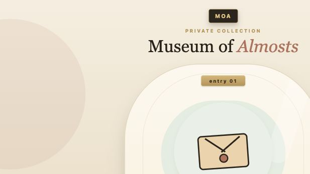
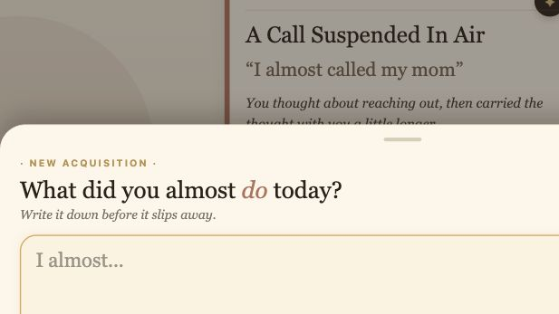

# Museum of Almosts

Museum of Almosts is a small mobile-first Expo app for the things you nearly did.

Users write a tiny "almost" from their day, and the app turns it into a museum exhibit: a title, a short exhibit label, a room, and an artifact image choice.

The current product direction is intentionally simple:

- **The Unsaid Wing**: almost-sent texts, calls, apologies, confessions, invitations, replies.
- **The Unmade Wing**: almost-started projects, trips, habits, meals, choices, tasks, versions of a day.

## Screenshots

### Home



### New Acquisition



## What It Does

The app asks:

```txt
What did you almost do today?
```

Example:

```txt
I almost told her I love you
```

The AI curator returns structured exhibit data:

```json
{
  "title": "The Words At The Edge",
  "label": "Love reached the doorway of being said.",
  "category": "The Unsaid Wing",
  "artifactImageKey": "folded-envelope"
}
```

The app then displays that entry as a small museum object.

## Tech Stack

- Expo
- React Native
- TypeScript
- React Native Web for browser preview
- OpenRouter / Owl Alpha for AI curation
- A small local Node server to keep the OpenRouter key out of the app bundle

## Architecture

```txt
Expo app
  -> local curator API
  -> OpenRouter Owl Alpha
  -> structured exhibit JSON
  -> app display
```

The app itself does not call OpenRouter directly. The backend lives at:

```txt
server/curator-server.mjs
```

That server receives the user's almost, sends it to Owl Alpha with the Museum of Almosts style guide, validates the response, and returns safe JSON to the app.

## Getting Started

Install dependencies:

```bash
npm install
```

Create your local env file:

```bash
cp .env.example .env
```

Then edit `.env`:

```txt
EXPO_PUBLIC_CURATOR_API_URL=http://localhost:8787/curate
OPENROUTER_API_KEY=your_openrouter_key
OPENROUTER_MODEL=openrouter/owl-alpha
CURATOR_PORT=8787
```

Start the AI curator server:

```bash
npm run curator
```

In another terminal, start the app:

```bash
npx expo start --web --port 9000
```

Open:

```txt
http://localhost:9000
```

Check the AI server:

```txt
http://localhost:8787/health
```

## Artifact Images

The app is designed to use a small saved image library before adding live image generation.

Artifact keys include:

- `folded-envelope`
- `postcard`
- `paint-tube`
- `ticket-stub`
- `map-pin`
- `moon-jar`
- `recipe-card`
- `seed-packet`
- `quiet-clock`

Add generated PNGs here:

```txt
assets/artifacts/
```

Then register them in:

```txt
src/data/artifactLibrary.ts
```

If an image is missing, the app falls back to hand-built React Native artifact shapes.

## Current Status

This is an MVP prototype. The core loop works:

- Add an almost
- Send it to the AI curator
- Receive title, label, room, and artifact key
- Display it as a museum exhibit

The next big improvements are:

- Add the full saved artifact image set
- Improve mobile interaction polish
- Persist user entries
- Add a room-change control if the curator gets a category wrong
- Deploy the curator server publicly for device testing

## Privacy Note

The current AI backend sends user text to OpenRouter / Owl Alpha. This is acceptable for early testing, but it should be reviewed before production if user privacy becomes a priority.
